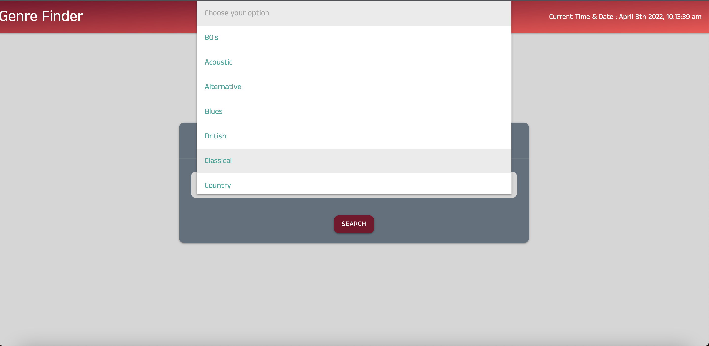

<h1 align="center">Genre-Finder</h1>
<h1 align="center"></h1>
<h2 align="center">Technologies Used</h1>

    
    
    

---

<h1 align="center">About This Application</h1>

This application was designed to allow the user to find new music in a particular genre that they are a fan of. The application has a drop down selection box where users can select a genre they'd like to search and then the application will display the top 10 albums and artists from that genre on a new page. The search history will be stored on the second page so users can see what they've previously searched for!

---

<h1 align="center">Screen Captures and Images</h1>

<a href="https://watch.screencastify.com/v/G90orRjurosh3jzEasXM">Mockup Video</a>

---

<h1 align="center">Functionality</h1>

User selects a genre choice from the dropdown selection field, then clicks on the search button. The page will then switch to a secondary HTML results page that will display the top 10 albums and artists from that genre. When the user clicks the search button it will request two fetches from the lastFM application programming interface (API). One fetch request pulls the artist information and the other pulls the albums. The application will display the top albums and artists in elements that are side by side and have clickable links to go to the lastFM page of the associated album or artist.

---

<h1 align="center">Contributions</h1>

Contributions are not currently accepted as production of application is on hiatus. Production and contributions to application may continue at a later date.

---

<h1 align="center">Live Link to Current Production State</h1>

<a href="https://stumartin22.github.io/genre-finder/">https://stumartin22.github.io/genre-finder/</a>

<h2 align="center">Github Repo for Genre-Finder</h2>

<a href="https://github.com/StuMartin22/genre-finder">https://github.com/StuMartin22/genre-finder</a>

---

<h1 align="center">Link to Author Githubs</h1>

<h2 align="center">Project Manager:</h2>

Stuart Martin

<a href="https://github.com/StuMartin22">https://github.com/StuMartin22</a>

 

<h2 align="center">Collaborators / Co-authors</h2>

Hannah Lodge

<a href="https://github.com/StuMartin22">https://github.com/hlodg</a>

Griffin Lundquist

<a href="https://github.com/GLundy99">https://github.com/GLundy99</a>

Eric Philipps

<a href="https://github.com/EricPhilipps">https://github.com/EricPhilipps</a>

